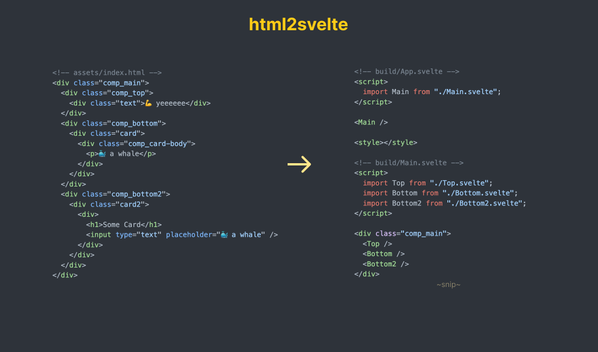

# html2svelte

> Convert HTML to Svelte components in a snap

Svelte is pretty 🔥 and offers a refreshing way to build web apps. html2svelte is a handy tool that transforms your HTML into Svelte components effortlessly.

Discover the ease of transforming HTML into Svelte components with html2svelte. Whether you're converting a single file or an entire directory, html2svelte streamlines the process, helping you integrate the sleek design capabilities of Svelte into your web development workflow.

## 💥 TLDR

Add `comp_` to the class names of your HTML elements and run `html2svelte` on your HTML files or folders to swiftly convert them into Svelte components.



## 📦 Install from npm

```bash
npm install -g html2svelte
```

## 📖 Commands

### Single File Conversion

```plaintext
$ html2svelte convert [FILE] --outDir=[OUTDIR] --prefix=[PREFIX]

Converts a single HTML file to a Svelte component.

Arguments:
  FILE     Path to the HTML file to be converted.

Flags:
  -o, --outDir   Directory to output the converted Svelte file (default: 'build').
  -p, --prefix   Prefix used to identify elements for conversion (default: 'comp_').
```

### Bulk Folder Conversion

```plaintext
$ html2svelte bulk-convert --folder=[FOLDER] --outDir=[OUTDIR] --prefix=[PREFIX]

Converts all HTML files in a specified folder and its subfolders to Svelte components.

Flags:
  -f, --folder   Folder containing HTML files to be converted.
  -o, --outDir   Directory to output the converted Svelte files (default: 'build').
  -p, --prefix   Prefix used to identify elements for conversion (default: 'comp_').
```

## 🛠️ Build from source

```bash
git clone https://github.com/Chizaruu/html2svelte.git
cd html2svelte
npm run bootstrap
# Run the tool on a single file or a folder
html2svelte convert assets/index.html
html2svelte bulk-convert --folder assets
# Format the output
prettier --plugin-search-dir . build/*.svelte -w
```

## ⚙️ How it works

1. The script identifies HTML files based on the provided CLI argument (single file or folder).
2. It parses each HTML file, looking for elements with class names starting with comp\_.
3. Svelte components are created for these elements, replacing the original HTML. The new Svelte files are placed in the specified output directory.
4. Prettier is run on the output directory to format the Svelte files.

## 🧠 Thoughts for Future Enhancements

- Developing a VS Code extension for more convenient use within the editor.
- Expanding functionality to cover a broader range of use cases.
- Improving handling of complex cases, particularly those not limited to single div elements.
